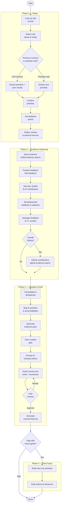

# Workflow

```mermaid
flowchart TB
    Start([Start]) --> R

    subgraph P1[Phase 1 — Setup]
        direction LR
        R[Look up role\n& level] --> RP[Detect role\nfamily & locale]
        RP --> CP{Previous Connect\nor priorities only?}
        CP -->|Full Connect| FC[Extract priorities +\nprior results]
        CP -->|Priorities only| PO[Extract core\npriorities]
        FC --> Confirm[Confirm\npriorities]
        PO --> Confirm
        Confirm --> LB[Set lookback\nperiod]
        LB --> CTX[Gather context\n& external sources]
    end

    CTX --> WE

    subgraph P2[Phase 2 — Evidence Gathering]
        direction LR
        WE[Work evidence\nm365-evidence-search] --> FB[Positive feedback\nfind-feedback]
        FB --> SQA[Security, Quality\n& AI contributions]
        SQA --> DEV[Developmental\nfeedback & setbacks]
        DEV --> MGR[Manager feedback\n& 1:1 context]
        MGR --> GH{Include\nGitHub?}
        GH -->|Yes| GHS[GitHub contributions\ngithub-evidence-search]
        GH -->|No| BRIDGE[ ]
        GHS --> BRIDGE
    end

    BRIDGE --> CON

    subgraph P3[Phase 3 — Compile & Draft]
        direction LR
        CON[Consolidate &\ndeduplicate] --> MAP[Map to priorities\n& accountabilities]
        MAP --> EP[Generate\nevidence pack]
        EP --> CUR[User curation\ngate]
        CUR --> MET[Prompt for\nmissing metrics]
        MET --> DFT[Draft Connect text\nwriter + humanizer]
        DFT --> REV{User\nreviews}
        REV -->|Revise| DFT
        REV -->|Approve| FIN[Generate\nconnect-final.md]
    end

    FIN --> P4{Help with\nfuture goals?}

    subgraph P4s[Phase 4 — Plan Future]
        direction LR
        GP[Draft new core priorities] --> AB[Draft actions & behaviors]
    end

    P4 -->|Yes| GP
    P4 -->|Skip| Done
    AB --> Done([Done])

    style BRIDGE fill:none,stroke:none
```
